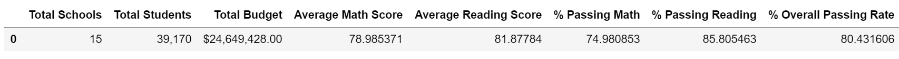
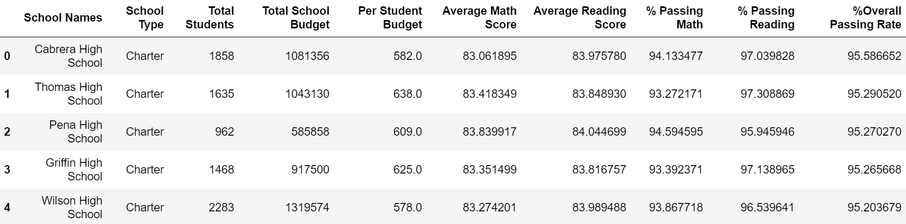
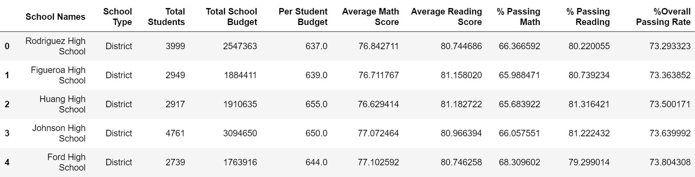
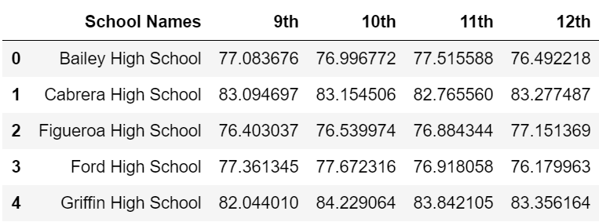
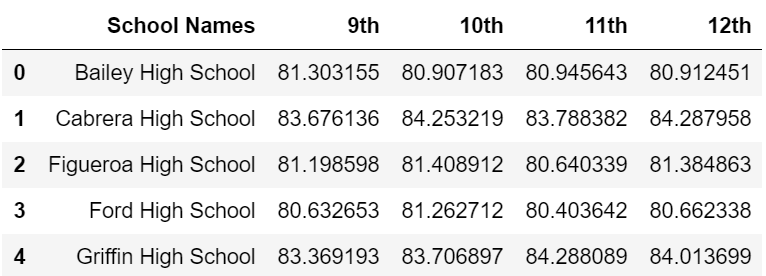
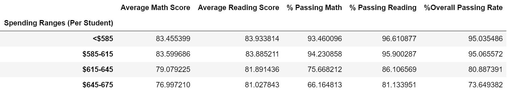
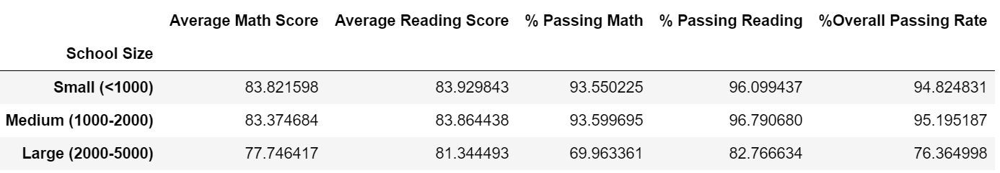
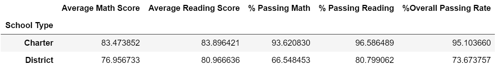

## Exercise Using Pandas

For this project, I analyzed the results of standardized tests for an entire school district. The data contains each student's math and reading scores, as well as a variety of information about the schools they attend.
 

## Tools used:
* Pandas library.
* Jupyter Notebook.

### District Summary

Table of the district's key metrics:
  * Total Schools
  * Total Students
  * Total Budget
  * Average Math Score
  * Average Reading Score
  * % Passing Math
  * % Passing Reading
  * Overall Passing Rate (Average of the above two)  

  

### School Summary

Table that summarizes key metrics about each school:
  * School Name
  * School Type
  * Total Students
  * Total School Budget
  * Per Student Budget
  * Average Math Score
  * Average Reading Score
  * % Passing Math
  * % Passing Reading
  * Overall Passing Rate (Average of the above two)  

  

### Top Performing Schools (By Passing Rate)

Table that highlights the top 5 performing schools based on Overall Passing Rate:
  * School Name
  * School Type
  * Total Students
  * Total School Budget
  * Per Student Budget
  * Average Math Score
  * Average Reading Score
  * % Passing Math
  * % Passing Reading
  * Overall Passing Rate (Average of the above two)  

  

### Bottom Performing Schools (By Passing Rate)

Table that highlights the bottom 5 performing schools based on Overall Passing Rate. Include all of the same metrics as above.  

  

### Math Scores by Grade

Table that lists the average Math Score for students of each grade level (9th, 10th, 11th, 12th) at each school:  

  

### Reading Scores by Grade

Table that lists the average Reading Score for students of each grade level (9th, 10th, 11th, 12th) at each school.  

  

### Scores by School Spending

Table that breaks down school performances based on average Spending Ranges (Per Student). I had to use 4 reasonable bins to group school spending.  

  

### Scores by School Size

Table that breaks down school performances based on School Size (Per Student). I had to use 4 reasonable bins to group school size (Small, Medium, Large).  

  

### Scores by School Type

Table that breaks down school performances based on School Type (Charter and District)   

   

# ANALYSIS
 
* The overall passing rate seems to be directly related to the type of school. Charter schools
have higher passing rates than district schools by around an average of 22% 
 
* According to the table "Scores by School Spending", there is a correlation in the opposite direction between the "spending ranges(per student)" and the overall passing scores. As the money invested in the student increases, the results in the math and reading exams decrease. Conclusion: Schools with higher spending averages, have lower overall passing rate
   
